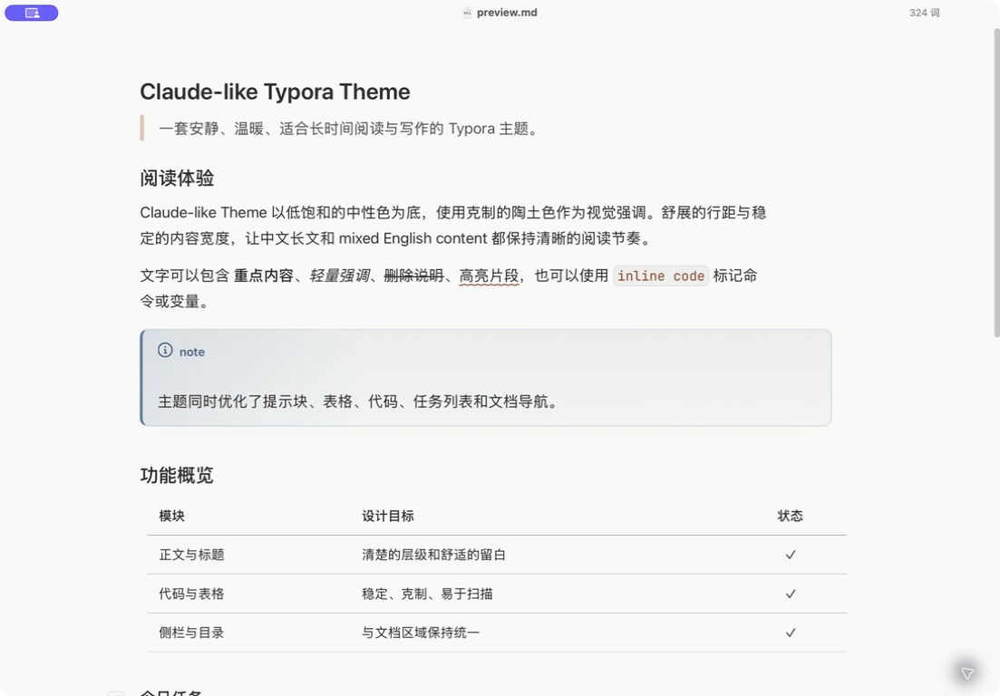
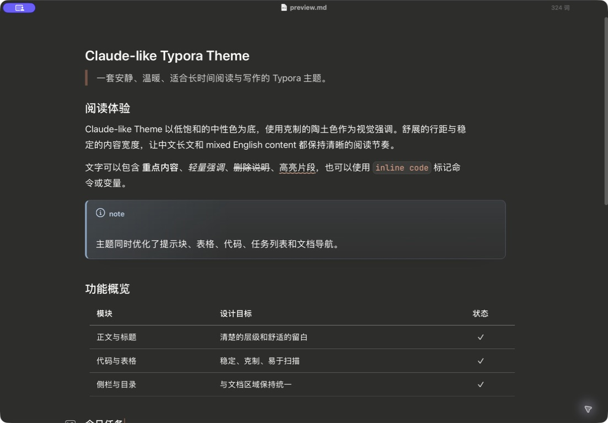

# Claude-like Typora Theme

一套受 Claude 阅读体验启发、为 Typora 精心打磨的明暗双主题。它使用温暖的中性色、克制的陶土色强调和舒展的排版，让中文长文、技术笔记与 Markdown 文档保持安静而清晰的阅读节奏。

> [English version](#english)

## 预览

### Claude Light



### Claude Dark



## 特色

- 提供 `Claude Light` 与 `Claude Dark` 两套协调一致的主题。
- 针对中文与中英文混排优化正文宽度、行距和标题层级。
- 完整适配 Typora 的文件树、目录、搜索、页签和一体化窗口。
- 统一表格、任务列表、引用、链接、脚注、目录与 YAML 元数据样式。
- 为行内代码、代码块、语言标签和语法高亮提供低干扰的视觉系统。
- 优化 Mermaid、数学公式、提示块和打印场景。
- 仅使用系统字体栈，不依赖网络字体或额外资源。

## 安装

1. 下载本仓库，或从 `Theme` 目录取得以下文件：
   - `claude-light.css`
   - `claude-dark.css`
2. 打开 Typora，进入 `设置 / 偏好设置 → 外观 → 打开主题文件夹`。
3. 将两个 CSS 文件复制到 Typora 主题文件夹。
4. 重启 Typora。
5. 从“主题”菜单选择 `Claude Light` 或 `Claude Dark`。

Typora 默认主题目录：

| 平台 | 路径 |
| --- | --- |
| macOS | `~/Library/Application Support/abnerworks.Typora/themes` |
| Windows | `%APPDATA%\Typora\themes` |
| Linux | `~/.config/Typora/themes` |

## 仓库结构

```text
.
├── Theme/
│   ├── claude-light.css
│   └── claude-dark.css
├── Image/
│   ├── claude-light-preview.jpg
│   └── claude-dark-preview.jpg
└── preview.md
```

`preview.md` 是用于快速检查常见 Markdown 元素显示效果的示例文档。

## 兼容性

主题面向当前桌面版 Typora 设计，并包含 macOS 与 Windows 一体化窗口的适配。Typora 后续版本如果调整界面结构，部分非文档区域的样式可能需要同步更新。

## 许可

本项目采用 [MIT License](LICENSE) 开源。

## 商标说明

Claude 是 Anthropic, PBC 的商标。本项目是独立的社区主题，与 Anthropic 无关联，也未获得其官方授权或认可。“Claude-like”仅表示视觉与阅读体验上的灵感来源。

---

<a id="english"></a>

## English

A polished light-and-dark theme pair for Typora, inspired by Claude's calm reading experience. Warm neutrals, restrained clay accents, and generous typography keep long-form writing and technical Markdown quiet, clear, and comfortable.

### Highlights

- Coordinated `Claude Light` and `Claude Dark` variants.
- Typography tuned for Chinese and mixed Chinese-English documents.
- Refined file tree, outline, search, tabs, and integrated window chrome.
- Consistent tables, task lists, blockquotes, links, footnotes, TOC, and YAML metadata.
- Purpose-built inline code, fenced code blocks, language labels, and syntax colors.
- Styling for Mermaid, math, alerts, and print layouts.
- System-font-only setup with no external font or network dependency.

### Installation

1. Download the repository, or get `claude-light.css` and `claude-dark.css` from `Theme`.
2. In Typora, open `Preferences → Appearance → Open Theme Folder`.
3. Copy both CSS files into the theme folder.
4. Restart Typora.
5. Select `Claude Light` or `Claude Dark` from the Themes menu.

### License

Released under the [MIT License](LICENSE).

### Trademark notice

Claude is a trademark of Anthropic, PBC. This independent community theme is not affiliated with, endorsed by, or sponsored by Anthropic. “Claude-like” refers only to its visual and reading-experience inspiration.
