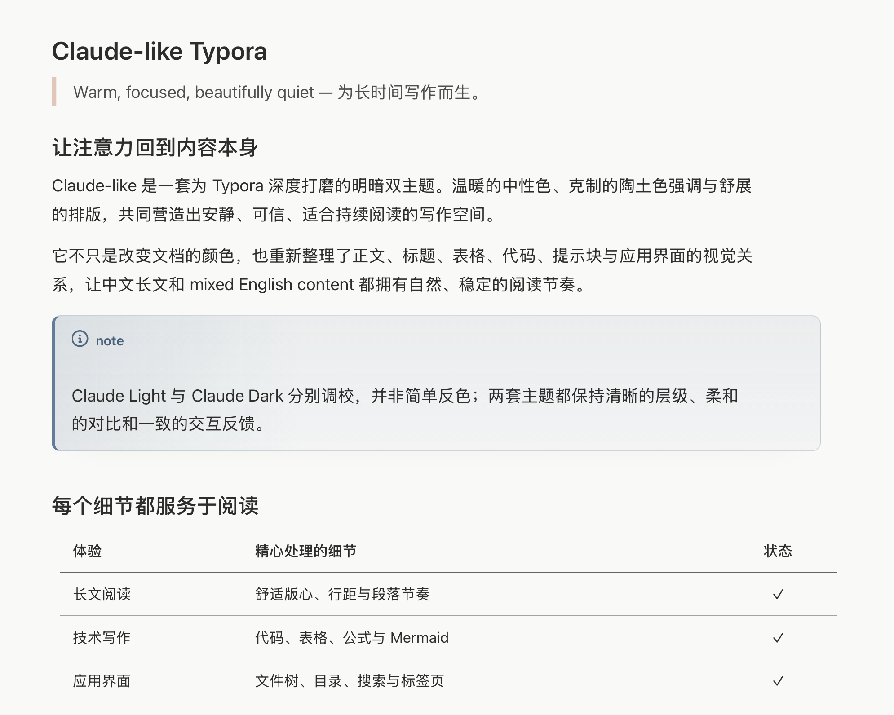
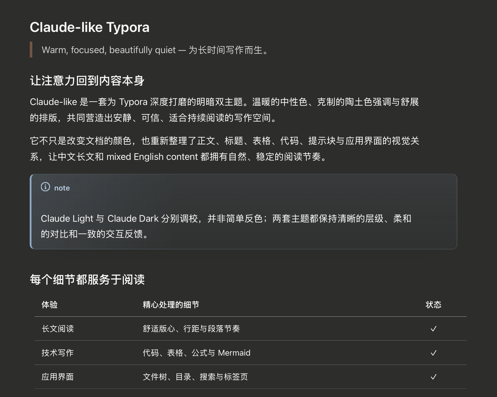

# Claude-like Typora Theme

简体中文 · [English](README.md)

一套受 Claude 安静阅读体验启发、为 Typora 深度打磨的明暗双主题。温暖的中性色、克制的陶土色强调和完整的应用界面适配，共同组成一个安静却不简陋的写作空间。

它不只是给文档换一组颜色。每套主题约包含 3,400 行 CSS，从正文排版、Markdown 组件、技术写作，到文件树、目录、菜单、窗口、响应式布局和打印输出，都进行了系统化处理。

## 主题预览

### Claude Light



### Claude Dark



## 功能概览

| 范围 | 已实现内容 |
| --- | --- |
| 主题版本 | 分别调校的浅色与深色配色系统 |
| 阅读排版 | 752 px 版心、1.72 行高、稳定的标题和正文节奏 |
| Markdown | 列表、任务、表格、引用、链接、脚注、目录、YAML 元数据 |
| 技术写作 | 行内代码、代码块、语言标签、语法高亮、数学公式、Mermaid |
| GFM 内容 | Note、Tip、Important、Warning、Caution 五类提示块 |
| Typora 界面 | 标签页、文件列表、文件树、大纲、搜索、底栏、菜单、设置与导出面板 |
| 编辑模式 | 源代码模式、专注模式和打字机模式细节优化 |
| 输出 | 打印/PDF 样式、分页保护和精确色彩输出 |
| 易用性 | 清晰焦点、可读对比、响应式断点、减少动态效果支持 |
| 依赖 | 主题 CSS 不依赖 CDN、网络字体、图片或其他在线资源 |

## 为什么这套主题不一样

### 明暗双主题不是简单反色

Claude Light 和 Claude Dark 使用同一套设计语言，但表面层级、边框、代码颜色、选择状态、阴影和次要文字均分别调校。深色版本采用温暖的炭灰而非纯黑；浅色版本采用柔和的暖白而非刺眼的纯白。

| 设计变量 | Claude Light | Claude Dark |
| --- | --- | --- |
| 主画布 | `#f9f9f7` | `#2d2d2b` |
| 抬升表面 | `#ffffff` | `#3d3d3a` |
| 正文文字 | `#2d2d2b` | `#f9f9f7` |
| 共同强调色 | `#cc7d5e` | `#cc7d5e` |

### 为持续阅读而设计的排版

写作区域采用稳定的 752 px 内容宽度、舒展的行距、克制的标题比例和经过整理的段落间距。中文长文不会显得松散，中英文混排也能保持清楚、连续的阅读节奏。

界面字体优先使用系统字体，代码字体在系统已安装时优先使用 JetBrains Mono，并提供完整的本地回退方案。不捆绑第三方字体，也不需要联网加载资源。

### 完整统一的 Markdown 组件系统

常用元素按照同一套视觉逻辑处理，而不是零散地覆盖样式：

- H1 到 H6 标题与平衡换行；
- 粗体、斜体、删除、下划线、选择和波浪高亮；
- 有序、无序、嵌套列表与自定义任务复选框；
- 具有表头层级、行反馈、边框和编辑控件的表格；
- 引用块与五种 GitHub 风格提示块；
- 链接、脚注、文档目录、分隔线和 YAML 元数据；
- 图片、图注、音视频、嵌入内容、数学公式和图表。

### 真正适合文档的代码样式

行内代码使用轻量标签式处理；代码块拥有独立表面、边框、语言标签、聚焦状态和语法配色。源代码模式沿用相同的颜色逻辑，从实时预览切换到 Markdown 源码时不会产生明显割裂。

语法系统能够区分注释、关键字、字符串、数字、标签、定义、变量和默认代码文字，同时避免像 IDE 一样过度鲜艳。

### Typora 应用本身也是主题的一部分

主题并没有停留在 `#write` 文档区域，还继续覆盖了 Typora 的应用界面：

- 顶部标签页、底部面板、右键菜单、滚动条和输入框；
- 文件列表、文件树、根目录、文件夹状态、搜索结果和文件标记；
- 带连接线、筛选、悬停和选中状态的大纲层级；
- 具有整行交互和清晰层级的文档内目录；
- 一体化标题栏、macOS 交通灯间距和 Windows Unibody 适配；
- 打开/导出交互、设置外壳和一体化菜单细节。

菜单、文件树和面板包含克制的动态反馈；当系统启用 `prefers-reduced-motion` 时，非必要动画会被关闭。

### 为导出和小窗口做过认真处理

打印规则会保持颜色，尽量避免表格和代码块跨页断裂，并防止标题与其后内容分离。1440、1200、992、768 和 720 px 多级响应式断点能够在窗口缩小时逐步保护写作区域和应用布局。

## 安装方法

### 下载正式版本

1. 打开 [最新 Release](https://github.com/Xv-Bowen/claude-like-typora-theme/releases/latest)。
2. 下载并解压 `claude-like-typora-theme-v1.0.0.zip`。
3. 在 Typora 中进入 `设置 / 偏好设置 → 外观 → 打开主题文件夹`。
4. 将 `claude-light.css` 和 `claude-dark.css` 复制到主题文件夹。
5. 重启 Typora。
6. 从“主题”菜单选择 `Claude Light` 或 `Claude Dark`。

### 从仓库直接安装

将 [`Theme/`](Theme/) 目录中的两个 CSS 文件直接复制到 Typora 主题文件夹，然后重启 Typora。

| 平台 | 默认主题目录 |
| --- | --- |
| macOS | `~/Library/Application Support/abnerworks.Typora/themes` |
| Windows | `%APPDATA%\Typora\themes` |
| Linux | `~/.config/Typora/themes` |

两份 CSS 均为自包含文件，不需要复制额外的资源目录。

## 仓库结构

```text
.
├── Theme/
│   ├── claude-light.css
│   └── claude-dark.css
├── Image/
│   ├── claude-light-preview.png
│   ├── claude-dark-preview.png
│   └── claude-like-xv-bowen-thumbnail.png
├── docs/
│   └── CUSTOMIZATION.md
├── CHANGELOG.md
├── LICENSE
├── README.md
├── README.zh-CN.md
└── preview.md
```

[`preview.md`](preview.md) 是一份可重复使用的视觉测试文档，涵盖长文、提示块、表格、任务、代码、数学公式、Mermaid 和脚注。

## 自定义主题

Typora 会在当前主题之后加载 `base.user.css` 和主题专属的用户 CSS。因此你可以在不修改主题源文件的情况下调整强调色、字体、正文宽度和排版间距。

可直接复制的示例见[自定义指南](docs/CUSTOMIZATION.md)。

## 兼容性与测试情况

- 主要在当前 macOS 桌面版 Typora 中设计并完成视觉验证。
- 包含明确的 macOS 一体化窗口和交通灯适配。
- 包含 Windows Unibody 选择器和多级响应式断点。
- Windows 与 Linux 尚未完成全面回归测试，欢迎提供问题报告和截图。
- 主题依赖 Typora 的应用 DOM；未来 Typora 如果调整非文档区域结构，相关选择器可能需要同步更新。

## 反馈与贡献

提交问题时，建议提供 Typora 版本、操作系统、当前主题版本、截图，以及能够复现问题的简短 Markdown 示例。欢迎提交 Pull Request，但请尽量保持明暗两套主题的视觉一致性。

## 开源协议

主题代码和仓库文档采用 [MIT License](LICENSE) 开源。

## 商标说明

Claude 是 Anthropic, PBC 的商标。本项目是独立的社区主题，与 Anthropic 无关联，也未获得其官方授权或认可。“Claude-like”仅表示视觉与阅读体验上的灵感来源。

