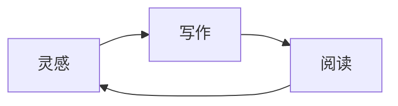

# Claude-like Typora

> Warm, focused, beautifully quiet — 为长时间写作而生。

## 让注意力回到内容本身

Claude-like 是一套为 Typora 深度打磨的明暗双主题。温暖的中性色、克制的陶土色强调与舒展的排版，共同营造出安静、可信、适合持续阅读的写作空间。

它不只是改变文档的颜色，也重新整理了正文、标题、表格、代码、提示块与应用界面的视觉关系，让中文长文和 mixed English content 都拥有自然、稳定的阅读节奏。

> [!NOTE]
> Claude Light 与 Claude Dark 分别调校，并非简单反色；两套主题都保持清晰的层级、柔和的对比和一致的交互反馈。

## 每个细节都服务于阅读

| 体验 | 精心处理的细节 | 状态 |
| --- | --- | :---: |
| 长文阅读 | 舒适版心、行距与段落节奏 | ✓ |
| 技术写作 | 代码、表格、公式与 Mermaid | ✓ |
| 应用界面 | 文件树、目录、搜索与标签页 | ✓ |

### 写作状态

- [x] 沉浸阅读与专注写作
- [x] 清晰的中英文混排
- [x] 明暗主题一致体验
- [ ] 下一篇值得认真写下的文字

## 克制，但绝不简陋

正文可以包含 **重点内容**、*轻量强调*、~~修订记录~~、==柔和高亮==，以及用于变量或命令的 `inline code`。链接、脚注[^1]、引用和列表拥有明确反馈，却不会抢走内容本身的注意力。

> 好的主题不应成为主角。它只需要在你阅读、思考和写作时，始终待在正确的位置。

### Code that belongs in the document

```typescript
type Theme = "claude-light" | "claude-dark";

function beginWriting(theme: Theme): string {
  return `A calm writing space with ${theme}`;
}

console.log(beginWriting("claude-light"));
```

## 数学、图表与结构化内容

行内公式 $E = mc^2$ 与独立公式都能融入文档节奏：

$$
\int_{-\infty}^{\infty} e^{-x^2}\,dx = \sqrt{\pi}
$$



---

愿界面保持安静，愿文字自然发光。

[^1]: 脚注同样经过排版与交互细节优化。
